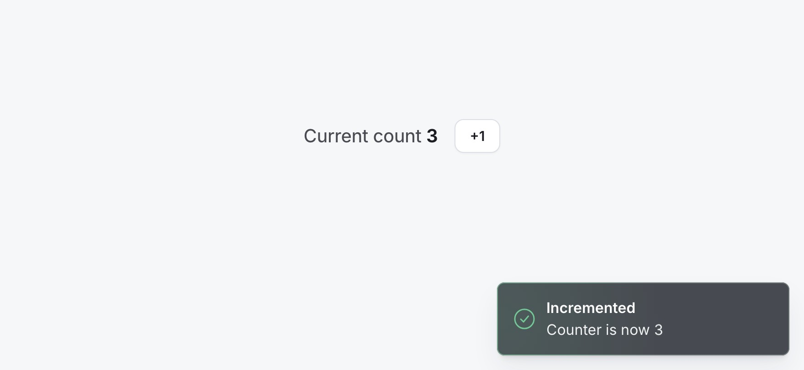

# ticker

**A `+1` counter with a toast matched to the screenshot down to the pixel — built as a craft exercise, not a feature.**

[](https://github.com/VictoriaL-y/ticker/actions/workflows/ci.yml)

<!-- live URL: pending Netlify deploy — tracked in #8 -->

> [**Live demo:**](https://ticker-yendou.netlify.app/)



The brief was a counter and a Chakra toast. That part takes twenty minutes. The interesting part is everything _around_ it — the animation, the focus states, the types, the edge cases, and a commit history that reads as a deliberate sequence of small, reviewed PRs. So that is what this optimizes for: depth on a tiny core, not breadth.

## Run it

```bash
npm install
npm run dev
```

Open the URL it prints. `npm test` runs the suite (19 tests); `npm run build` produces the production build. Built on Node 24, CI runs Node 22.

## What's here

- A `Counter` with a global `CounterContext` / `CounterProvider` and a guarded `useCounter()` hook that **throws a typed error** if it's used outside its provider.
- A **single, self-updating** toast — delivered by Chakra's `createToaster`, with fully custom content so the visual is mine to the pixel.
- Motion on every interaction (toast enter/exit, the count, the button), all of it gated behind `prefers-reduced-motion`.

Stack: **Next.js 16 (App Router) · React 19 · TypeScript (strict, `noUncheckedIndexedAccess`) · Chakra UI v3 · CSS Modules · Vitest + Testing Library**. Deliberately the same shape as Yendou's (TS · React · Next), because wiring Chakra into the App Router _is_ part of the exercise.

## Design decisions, and the why

### The rounded gradient border — the detail that's easy to get subtly wrong

The screenshot's card has a 1px border that is green on the left and fades to grey. The obvious approach, `border-image` with a gradient, **does not respect `border-radius`** — you get a gradient border with square corners on a rounded card. The fix is a `::before` overlay at `inset: 0` holding the gradient, with `mask` + `mask-composite: exclude` (and the `-webkit-` prefix for Safari) punching out the interior so only a 1px rounded hairline remains. It lives in [`ToastContent.module.css`](src/toast/ToastContent.module.css) so the gnarly bit is in one reviewable place.

One subtlety that only a measurement caught: the green radial has to sit **on top of** the grey base layer. Painted the other way round, the opaque grey wins and the border renders flat grey — and it looks _fine_ by eye. See [verification](#verification).

### One toast, not a pile

Rapid clicks update **one** toast (a stable id, `"counter"`, that upserts to the latest value) and reset its dismiss timer, instead of stacking five toasts that say different numbers. The latest value supersedes the rest, which is both more correct and free of pile-up.

The toast also must **not** fire on the initial render. The natural "have I mounted?" boolean breaks under React StrictMode, which double-invokes the mount effect in development and fires a spurious count-0 toast. Comparing against the _previous value_ (a ref) is immune — the ref only advances on a real change. ([`use-counter-toast.ts`](src/toast/use-counter-toast.ts))

### The toaster renders on the client only

A toast only ever exists _after_ a client interaction, so there is nothing for the server to render — gating the toaster on a hydration flag keeps an empty live-region out of the SSR payload. To be precise about it: Chakra's `Portal` is itself SSR-safe, so this is a **cleanliness choice, not a hydration fix**. (An earlier draft of mine claimed it _was_ a hydration fix; re-testing showed that was wrong, so the comment says what's actually true. There _is_ a separate, real hydration issue — see [what's next](#whats-next).)

### Motion that respects the user

- **Enter / exit** are CSS keyframes keyed off the `data-state` the toast machine sets on the root (`open` while visible, `closed` while leaving). The exit duration is **derived** from the machine's own removal window (`var(--remove-delay)`) instead of hand-synced to a second magic number, so the two can't drift.
- **The count** rises and fades into place on each change — a cue, not a slot-machine roll. The number is its own element keyed on the count, so it re-mounts and replays the keyframe while the rest of the line stays put.
- **The button** gives a little on press (`scale .97`) and lifts on hover.
- **Every** animation is gated behind `prefers-reduced-motion`. The one JS-driven piece (the count flourish) is gated _twice_ — by a `useSyncExternalStore` hook **and** a CSS `@media` rule — so it stays instant even during the first paint, before the hook has read the live setting.

### Types that make misuse hard

`strict` plus `noUncheckedIndexedAccess`, zero `any`, a fully typed context value, and a `useCounter()` that fails loudly outside its provider. Large numbers are formatted with `Intl.NumberFormat` (grouping separators) rather than capped — `Number.MAX_SAFE_INTEGER` is unreachable by clicking, so formatting is the honest answer, not a guard nobody hits.

## What I added beyond the AI baseline

An AI can write all of this code. The value I added is the part that makes it _good_:

- **Architecture** — splitting the toast's _appearance_ (`ToastContent`, pure and presentational) from its _delivery_ (`Toaster` + the count-driven hook). They're different concerns with different failure modes, so they're different modules; the pure component is trivially testable and Storybook-able.
- **Taste and restraint** — no decrement, reset, multi-counter, theme toggle, or state library for a single integer. The brief asked for `+1`; extra buttons add surface, not delight. Restraint was a deliberate, defended choice.
- **A real review gate** — every piece shipped as a small PR with a scoped code review before merge. When the reviewer was right I applied it (deriving the exit timing from `--remove-delay` came from that pass); when it was a nitpick I said so.
- **Rigor that caught things the eye doesn't:**
  - Pixel-sampling the rendered card against the screenshot caught the gradient-border layer-order bug above — invisible by eye, obvious to a sampled pixel.
  - I verified the motion by driving the real app under headless Chrome and reading the **DevTools Animation domain** — proving the three keyframes actually fire (and that reduced-motion suppresses all three), rather than asserting "it animates" and hoping.
  - That same headless pass surfaced **two pre-existing console issues** the scaffold shipped — a Chakra/Emotion SSR hydration mismatch and a `flushSync`-in-effect warning. I root-caused both and wrote them up with fixes ([#10](https://github.com/VictoriaL-y/ticker/issues/10), [#11](https://github.com/VictoriaL-y/ticker/issues/11)).
  - I corrected my _own_ overclaim (the "hydration fix" above) once a re-test showed it was wrong. Honest comments over flattering ones.

That trail — AI-authored PRs, green checks, and a human review and verification on every one — is where the work actually is. The code is the cheap part.

## Verification

Evidence over assertions. Alongside the 19 automated tests (TDD for the logic — the hook, the skip-initial, the reduced-motion gating):

- The settled toast was **measured** against the screenshot with PIL (colours, proportion, border) — not eyeballed.
- The motion was confirmed frame-by-frame and via the Animation domain under headless Chrome, including an emulated `prefers-reduced-motion` run that shows the keyframes _not_ firing.
- A pixel diff confirms the animation work left the pixel-matched card byte-identical.

## What's next

Deliberate next steps, scoped out to keep each PR small — tracked as issues, not forgotten:

- [#4](https://github.com/VictoriaL-y/ticker/issues/4) — a small Storybook for `ToastContent`
- [#5](https://github.com/VictoriaL-y/ticker/issues/5) — accessibility pass (focus-visible polish, `axe`, keyboard, reconciling the nested live-region)
- [#6](https://github.com/VictoriaL-y/ticker/issues/6) — edge-case tests (spam, large numbers, auto-dismiss) and the sustained-click timer-reset
- [#7](https://github.com/VictoriaL-y/ticker/issues/7) — a subtle milestone flourish every tenth count
- [#8](https://github.com/VictoriaL-y/ticker/issues/8) — deploy to Netlify and add the live link + badge
- [#10](https://github.com/VictoriaL-y/ticker/issues/10) · [#11](https://github.com/VictoriaL-y/ticker/issues/11) — the two pre-existing SSR/console issues found during verification, each with a root cause and a proposed fix

## Where things live

```
src/
  counter/   CounterContext + guarded useCounter() + the Counter component
  toast/      Toaster (Chakra delivery) · ToastContent (pure card) · CheckRing · the count-driven hook
  lib/        formatCount (Intl.NumberFormat) · usePrefersReducedMotion (SSR-safe)
docs/         DESIGN.md (decisions + rationale) · PLAN.md (the build sequence)
```

The reasoning behind the choices above is in [`docs/DESIGN.md`](docs/DESIGN.md); the build sequence is in [`docs/PLAN.md`](docs/PLAN.md).
